<div align="center">
# RoadSOS+

**A full-stack road incident reporting system with AI-assisted severity
analysis and an authority dashboard.**


Citizens can report road hazards with location and images, while
authorities can review reports, update their status, and monitor
incidents through a dashboard.

</div>

**Live Demo:** https://road-sos-plus-frno.vercel.app

------------------------------------------------------------------------
## Screenshots

### Home Page

The landing page introduces the platform and its core features.

<p align="center">
  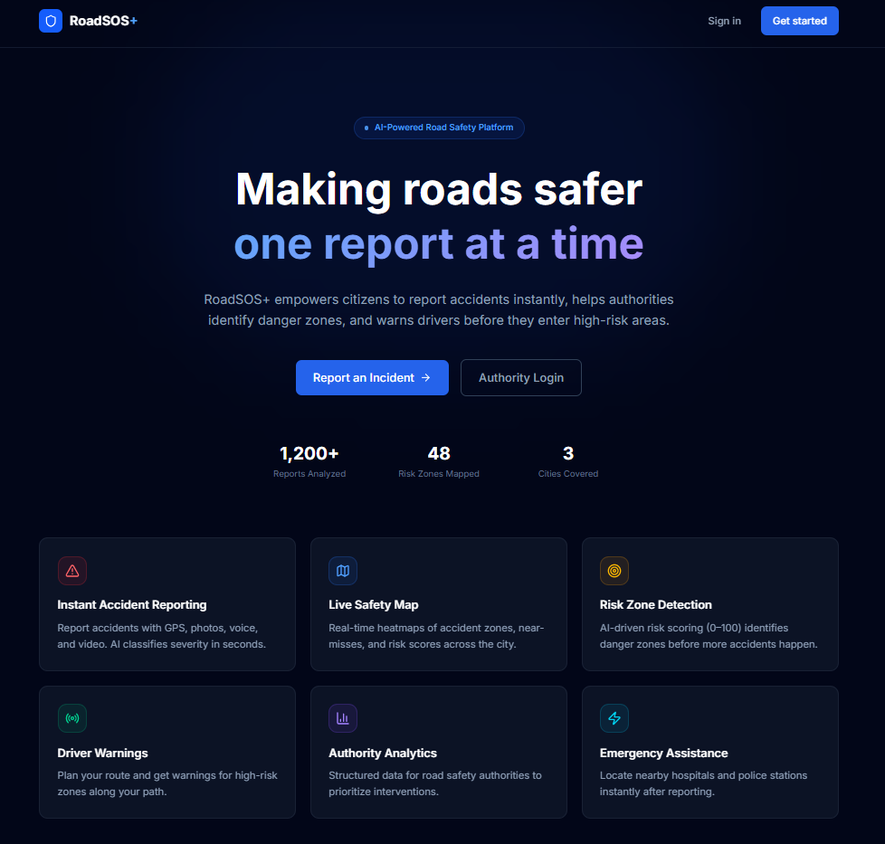
</p>

---

### User Registration

Citizens can create an account to report incidents and track their submissions.

<p align="center">
  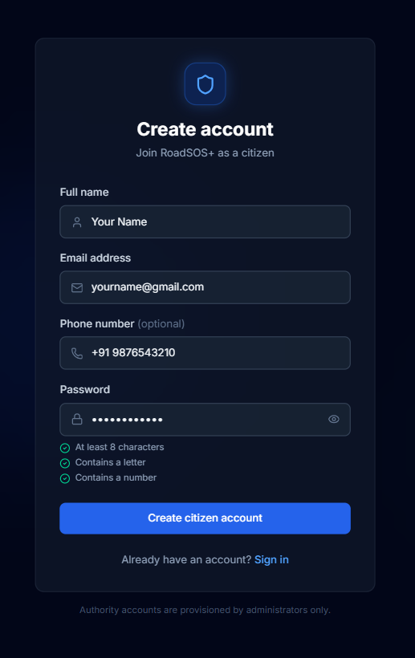
</p>

---

### Citizen Dashboard

Overview of user reports, nearby alerts, and quick actions.

<p align="center">
  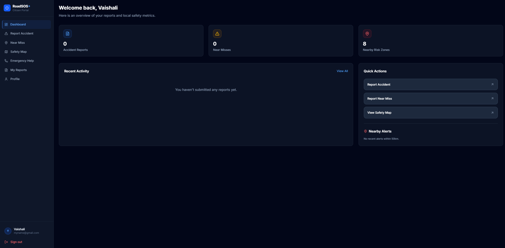
</p>

---

### Report Near Miss

Log hazards such as potholes, blind turns, or damaged roads before accidents occur.

<p align="center">
  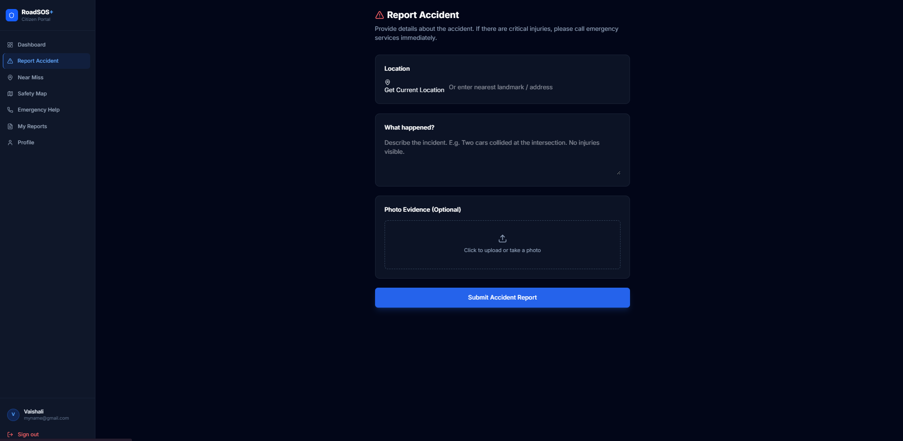
</p>

---

### Interactive Safety Map

View reported incidents and high-risk zones on an interactive map.

<p align="center">
  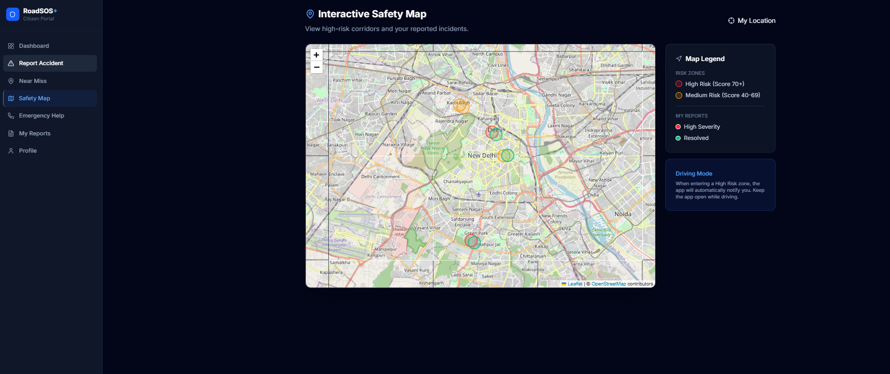
</p>

---

### Emergency Assistance

Locate nearby hospitals and police stations using the user's current location.

<p align="center">
  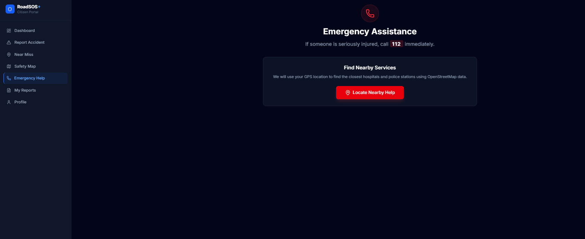
</p>

---

### Authority Dashboard

Overview of incidents, reports, and system statistics.

<p align="center">
  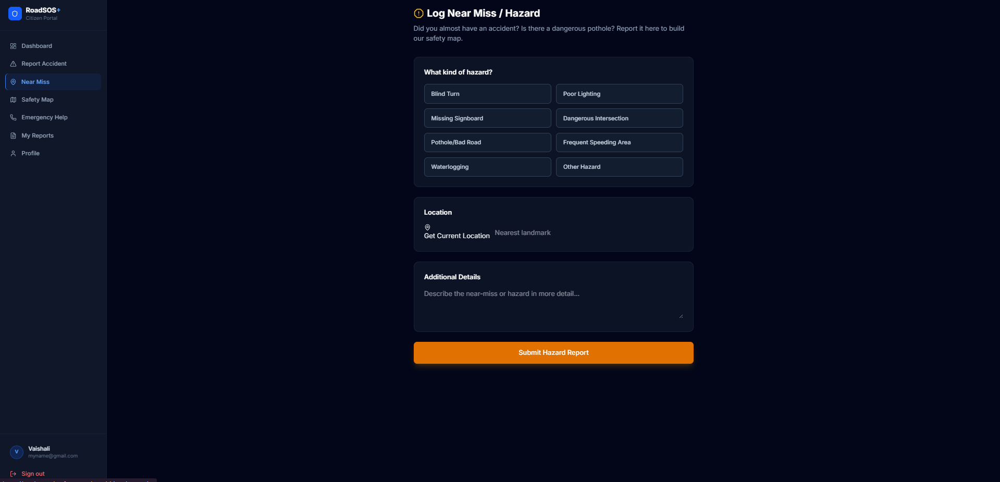
</p>

---

### Incident Management

Authorities review reports, verify incidents, and update their status.

<p align="center">
  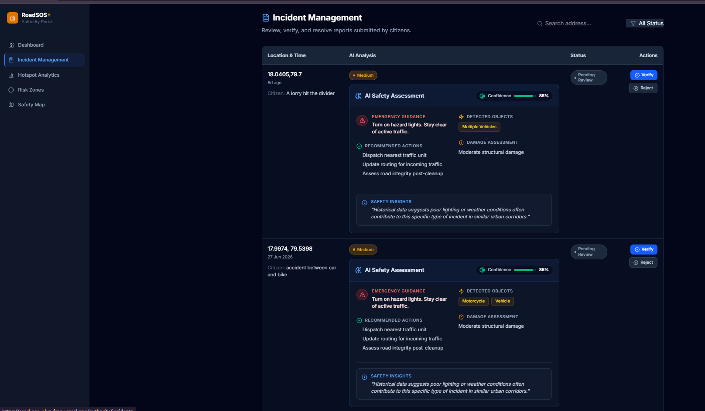
</p>

---

### Analytics Dashboard

Analyze incident severity, near misses, and overall safety metrics.

<p align="center">
  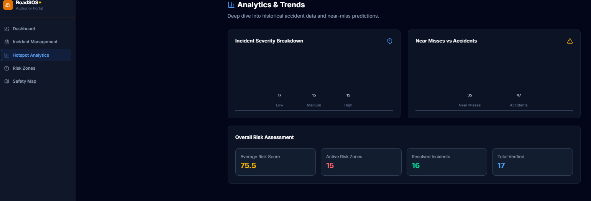
</p>

---

### Risk Zone Detection

Identify accident hotspots and receive AI-generated recommendations.

<p align="center">
  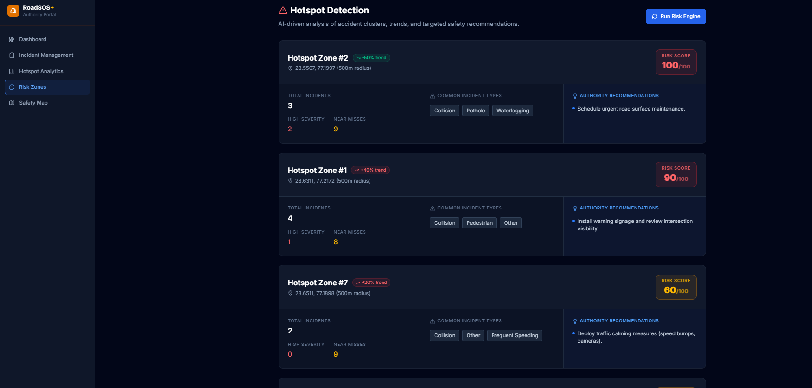
</p>

# Overview

RoadSOS+ is a web application for reporting and managing road hazards
such as potholes, damaged roads, broken traffic signals, and accidents.

The platform connects citizens and authorities through a single
workflow. Citizens submit incidents, while authorities verify reports,
prioritize them, and track their resolution.

Google Gemini API is used to generate incident summaries and estimate
severity.

# Problem Statement

Road hazards are often reported through manual inspections or phone
calls, making it difficult to identify and prioritize critical issues.

RoadSOS+ provides a centralized platform for reporting, tracking, and
managing road incidents using maps, AI-assisted analysis, and role-based
dashboards.


# Features

- User registration and authentication
- Report road incidents with location and images
- Report near-miss road hazards
- Interactive safety map
- AI-generated incident summaries and severity prediction
- Authority dashboard for incident management
- Risk zone detection and analytics
- Emergency assistance

# Tech Stack

  Layer            Technologies
  ---------------- ---------------------------------------
  Frontend         Next.js, React, Tailwind CSS, Zustand
  Backend          FastAPI, Python
  Database         PostgreSQL, SQLAlchemy
  Authentication   JWT
  AI               Google Gemini API
  Storage          Cloudinary
  Deployment       Docker, Railway, Vercel

# System Architecture

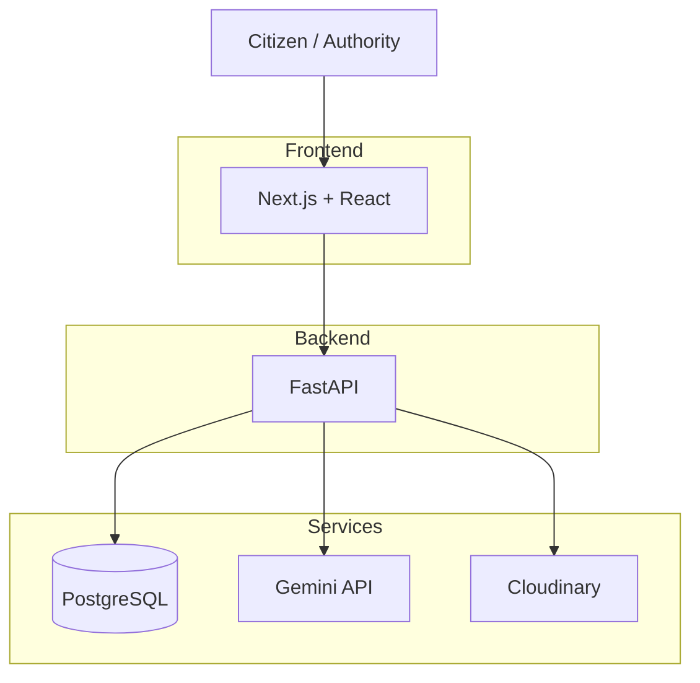

## Request Flow

1.  User submits an incident.
2.  Frontend sends the request to FastAPI.
3.  Backend stores the incident.
4.  Images are uploaded to Cloudinary.
5.  Gemini generates summary and severity.
6.  Authorities review and update status.

## Database Design

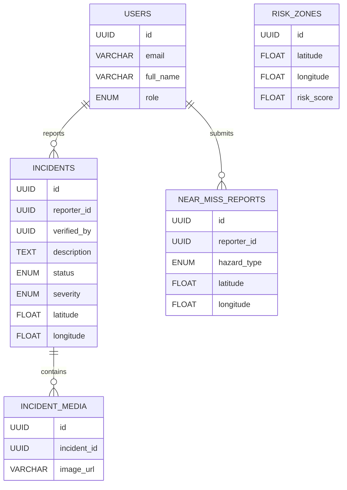


# Project Structure

``` text
RoadSOSPlus/
├── frontend/
├── backend/
├── docs/
│   └── screenshots/
├── docker-compose.yml
└── README.md
```

# API Overview

  Method   Endpoint                 Access
  -------- ------------------------ ---------------
  POST     /auth/register           Public
  POST     /auth/login              Public
  GET      /users/me                Authenticated
  POST     /incidents               Citizen
  PUT      /incidents/{id}/status   Authority

Swagger: `/api/docs`

## Environment Variables

### Backend

| Variable | Description |
|----------|-------------|
| DATABASE_URL | PostgreSQL connection |
| SECRET_KEY | JWT signing key |
| GEMINI_API_KEY | Gemini API key |
| CLOUDINARY_* | Cloudinary credentials |

### Frontend

| Variable | Description |
|----------|-------------|
| NEXT_PUBLIC_API_URL | Backend API URL |


# Getting Started

## Docker

``` bash
git clone https://github.com/vallurivaishali/RoadSOSPlus.git
cd RoadSOSPlus
docker-compose up --build
```

## Local

Backend:

``` bash
cd backend
python -m venv venv
pip install -r requirements.txt
alembic upgrade head
uvicorn app.main:app --reload
```

Frontend:

``` bash
cd frontend
npm install
npm run dev
```

# Deployment

  Service    Platform
  ---------- ----------------------
  Frontend   Vercel
  Backend    Railway
  Database   PostgreSQL (Railway)

# Security

-   JWT authentication
-   Role-based access control
-   Password hashing with bcrypt
-   Request validation using Pydantic

# Technical Challenges

### Leaflet with Next.js

**Challenge:** Leaflet depends on browser APIs.

**Solution:** Loaded map components dynamically with SSR disabled.

### AI Processing

**Challenge:** AI increased response time.

**Solution:** Used FastAPI BackgroundTasks.

### Database Initialization

**Challenge:** Avoid duplicate seed data.

**Solution:** Startup script runs migrations and seeds only when
required.

### Authentication

**Challenge:** Different permissions for citizens and authorities.

**Solution:** JWT with role-based authorization.

# Design Decisions

-   FastAPI for REST APIs.
-   PostgreSQL for relational storage.
-   Cloudinary for image storage.
-   BackgroundTasks for asynchronous AI processing.
-   Zustand for frontend state management.

# Future Improvements

-   WebSockets
-   Redis caching
-   PostGIS
-   Notifications
-   Image moderation

## Author

**Vaishali Valluri**

- GitHub: [vallurivaishali](https://github.com/vallurivaishali)
- LinkedIn: [Vaishali Valluri](https://www.linkedin.com/in/valluri-vaishali-478039363)


<br />
<div align="center">
  <i>If you found this repository helpful, please consider leaving a ⭐!</i>
</div>
